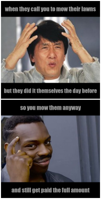

<p img align="center">
  
</p>

<h2 align="center">
  STATS 220 - Assignment One  
</h2>
<h3 align="center">
  Yvonne Ryan
</h3>

<p align="center">
     Welcome to my STATS 220 Assignment 1! <br /> <br /> Below is the meme I've created! The inspiration for this meme comes from my role in helping to run a small lawn-mowing and garden maintenance business in Tauranga! :deciduous_tree:
</p> 

<p img align="center">
  
</p>

<p align="center">
  Throughout my time working on people's gardens and lawns, I've met some very interesting characters, and some who aren't quite aware that the purpose of lawn mowing is to cut the grass - not :sparkles: <em>just</em> :sparkles: to walk the mower over it! 
 </p>

<p align="center">
     Unless you would like to be ripped off, <br /> 
  <em>please</em> <br /> 
  <strong>Don't be that person</strong>
</p>

### About my meme

Now that you know a little of the inspiration behind my meme, let me tell you how I created it! 

Though the images used are of two very well known memes, I've adjusted the context to suit my day-to-day dealings - the pictures describe exactly what goes through my head on a daily basis! Thus, making it original and adapted to me! 

To create them, I used the R [{magick}](https://cran.r-project.org/web/packages/magick/vignettes/intro.html) package and `R` code which is displayed below: 

 ```r
# first text line 
line1 <- image_blank(width = 500, 
                     height = 80,
                     color = "#000000") %>%
  image_annotate(text = "when they call you to mow their lawns",
                 color = "#999999",
                 size = 30,
                 font = "Impact",
                 gravity = "center")

# second text line 
line2 <- image_blank(width = 500, 
                     height = 80,
                     color = "#000000") %>%
  image_annotate(text = "but they did it themselves the day before",
                 color = "#999999",
                 size = 28,
                 font = "Impact",
                 gravity = "center")

# third text line
line3 <- image_blank(width = 500, 
                     height = 80,
                     color = "#000000") %>%
  image_annotate(text = "so you 'mow' them anyway",
                 color = "#999999",
                 size = 30,
                 font = "Impact",
                 gravity = "center")

# fourth text line 
line4 <- image_blank(width = 500, 
                     height = 80,
                     color = "#000000") %>%
  image_annotate(text = "and still get paid the full amount",
                 color = "#999999",
                 size = 30,
                 font = "Impact",
                 gravity = "center")

# little white gap
line_break <- image_blank(width = 500,
                          height = 5,
                          color = "white")

# adding first image 
confused_meme <- image_read("https://i.imgflip.com/4/qiev6.jpg") %>%
  image_scale(500)

# adding second image 
you_know <- image_read("https://www.naijaloaded.com.ng/wp-content/uploads/2019/06/20180703190744-rollsafe-meme-520x350.jpeg") %>%
  image_scale(500)

# putting meme together!
top_meme <- image_append(c(line1, confused_meme, line2), stack = TRUE)
bottom_meme <- image_append(c(line3, you_know, line4), stack = TRUE)
meme <- c(top_meme, line_break, bottom_meme) %>%
  image_append(stack = TRUE) %>%
  image_border("white", "5x5") %>%
  image_scale(200)

# saving meme - the most important part!
image_write(meme, "images/my_meme.png")
```
Thanks for reading! 
