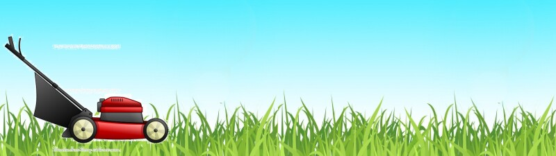

```{r}
# creating background
grass_image2 <- image_read("http://clipart-library.com/images/rTLoR88zc.jpg") %>%
  image_scale(400) %>%
  image_background('none')

grass <- image_append(c(grass_image2, grass_image2))

# creating foreground 
mower_image <- image_read("https://www.how-to-draw-funny-cartoons.com/images/cartoon-lawn-mower-007.jpg") %>%
  image_transparent('white') %>% 
  image_background('none') %>%
  image_scale(250)

# creating frames 
frame1 <- image_composite(grass, mower_image, offset = "+0+45")
frame2 <- image_composite(grass, mower_image, offset = "+10+45")
frame3 <- image_composite(grass, mower_image, offset = "+20+45")
frame4 <- image_composite(grass, mower_image, offset = "+30+45")
frame5 <- image_composite(grass, mower_image, offset = "+40+45")
frame6 <- image_composite(grass, mower_image, offset = "+50+45")
frame7 <- image_composite(grass, mower_image, offset = "+60+45")
frame8 <- image_composite(grass, mower_image, offset = "+70+45")
frame9 <- image_composite(grass, mower_image, offset = "+80+45")
frame10 <- image_composite(grass, mower_image, offset = "+90+45")
frame11 <- image_composite(grass, mower_image, offset = "+100+45")
frame12 <- image_composite(grass, mower_image, offset = "+120+45")
frame13 <- image_composite(grass, mower_image, offset = "+130+45")
frame14 <- image_composite(grass, mower_image, offset = "+140+45")
frame15 <- image_composite(grass, mower_image, offset = "+150+45")
frame16 <- image_composite(grass, mower_image, offset = "+160+45")
frame17 <- image_composite(grass, mower_image, offset = "+170+45") %>%
  image_annotate(text = 'W', size = 70, font = 'Bradley Hand ITC', color = '#fc7303', gravity = 'north')
frame18 <- image_composite(grass, mower_image, offset = "+180+45") %>%
  image_annotate(text = 'W', size = 70, font = 'Bradley Hand ITC', color = '#fc7303', gravity = 'north')
frame19 <- image_composite(grass, mower_image, offset = "+190+45") %>%
  image_annotate(text = 'W E', size = 70, font = 'Bradley Hand ITC', color = '#fc7303', gravity = 'north')
frame20 <- image_composite(grass, mower_image, offset = "+200+45") %>%
  image_annotate(text = 'W E', size = 70, font = 'Bradley Hand ITC', color = '#fc7303', gravity = 'north')
frame21 <- image_composite(grass, mower_image, offset = "+210+45") %>%
  image_annotate(text = 'W E L', size = 70, font = 'Bradley Hand ITC', color = '#fc7303', gravity = 'north')
frame22 <- image_composite(grass, mower_image, offset = "+220+45") %>%
  image_annotate(text = 'W E L', size = 70, font = 'Bradley Hand ITC', color = '#fc7303', gravity = 'north')
frame23 <- image_composite(grass, mower_image, offset = "+230+45") %>%
  image_annotate(text = 'W E L C', size = 70, font = 'Bradley Hand ITC', color = '#fc7303', gravity = 'north')
frame24 <- image_composite(grass, mower_image, offset = "+240+45")%>%
  image_annotate(text = 'W E L C', size = 70, font = 'Bradley Hand ITC', color = '#fc7303', gravity = 'north')
frame25 <- image_composite(grass, mower_image, offset = "+250+45") %>%
  image_annotate(text = 'W E L C O', size = 70, font = 'Bradley Hand ITC', color = '#fc7303', gravity = 'north')
frame26 <- image_composite(grass, mower_image, offset = "+260+45") %>%
  image_annotate(text = 'W E L C O', size = 70, font = 'Bradley Hand ITC', color = '#fc7303', gravity = 'north')
frame27 <- image_composite(grass, mower_image, offset = "+270+45") %>%
  image_annotate(text = 'W E L C O M', size = 70, font = 'Bradley Hand ITC', color = '#fc7303', gravity = 'north')
frame28 <- image_composite(grass, mower_image, offset = "+280+45") %>%
  image_annotate(text = 'W E L C O M', size = 70, font = 'Bradley Hand ITC', color = '#fc7303', gravity = 'north')
frame29 <- image_composite(grass, mower_image, offset = "+290+45") %>%
  image_annotate(text = 'W E L C O M E', size = 70, font = 'Bradley Hand ITC', color = '#fc7303', gravity = 'north')
frame30 <- image_composite(grass, mower_image, offset = "+300+45") %>%
  image_annotate(text = 'W E L C O M E', size = 70, font = 'Bradley Hand ITC', color = '#fc7303', gravity = 'north')
frame31 <- image_composite(grass, mower_image, offset = "+310+45") %>%
  image_annotate(text = 'W E L C O M E !', size = 70, font = 'Bradley Hand ITC', color = '#fc7303', gravity = 'north')
frame32 <- image_composite(grass, mower_image, offset = "+320+45") %>%
  image_annotate(text = 'W E L C O M E !', size = 70, font = 'Bradley Hand ITC', color = '#fc7303', gravity = 'north')
frame33 <- image_composite(grass, mower_image, offset = "+330+45") %>%
  image_annotate(text = 'W E L C O M E ! !', size = 70, font = 'Bradley Hand ITC', color = '#fc7303', gravity = 'north')
frame34 <- image_composite(grass, mower_image, offset = "+340+45") %>%
  image_annotate(text = 'W E L C O M E ! !', size = 70, font = 'Bradley Hand ITC', color = '#fc7303', gravity = 'north')
frame35 <- image_composite(grass, mower_image, offset = "+350+45") 
frame36 <- image_composite(grass, mower_image, offset = "+360+45")
frame37 <- image_composite(grass, mower_image, offset = "+370+45")
frame38 <- image_composite(grass, mower_image, offset = "+380+45")
frame39 <- image_composite(grass, mower_image, offset = "+390+45")
frame40 <- image_composite(grass, mower_image, offset = "+400+45")
frame41 <- image_composite(grass, mower_image, offset = "+410+45")
frame42 <- image_composite(grass, mower_image, offset = "+420+45")
frame43 <- image_composite(grass, mower_image, offset = "+430+45")
frame44 <- image_composite(grass, mower_image, offset = "+440+45")
frame45 <- image_composite(grass, mower_image, offset = "+450+45")
frame46 <- image_composite(grass, mower_image, offset = "+460+45")
frame47 <- image_composite(grass, mower_image, offset = "+470+45")
frame48 <- image_composite(grass, mower_image, offset = "+480+45")
frame49 <- image_composite(grass, mower_image, offset = "+490+45")
frame50 <- image_composite(grass, mower_image, offset = "+500+45")
          # i sincerely apologize for the amount of code here - there must have been an easier way, 
                                        #i just couldn't find it! 

# putting the frames in order using a vector 
frames <- c(frame1, frame2, frame3, frame4, frame5, frame6, frame7, frame8, frame9, frame10, frame11, frame12, frame13, frame14, frame15, frame16, frame17, frame18,frame19, frame20, frame21, frame22, frame23, frame24, frame25, frame26, frame27, frame28, frame29, frame30,frame31, frame32, frame33, frame34, frame35, frame36, frame37, frame38, frame39, frame40, frame41, frame42, frame43, frame44, frame45, frame46, frame47, frame48, frame49, frame50)

# creating the animation! 
image_animate(frames, fps = 10) %>%
  image_scale(910)
```



Create a new file within your stats220 repo called “index.md”.

Edit the index.md file so that it displays a new original meme that you have created using Rcode and the {magick} package, as well as the R code you used to create it.


Your index.md file needs contain information about the meme you created, for example, whatthe motivation was, and how your meme is new/original (e.g. an adaption of an existing memeformat).

Either one or both of your README.md and index.md files needs text that demonstrates at least the following Markdown syntax:
- use of two different levels of headers
- use of two different types of bullet points (ordered or unordered)
- use of bold and italics
- use of links to other websites
- use of images, including those within your repository and those accessed from other websites
- use of code fences
